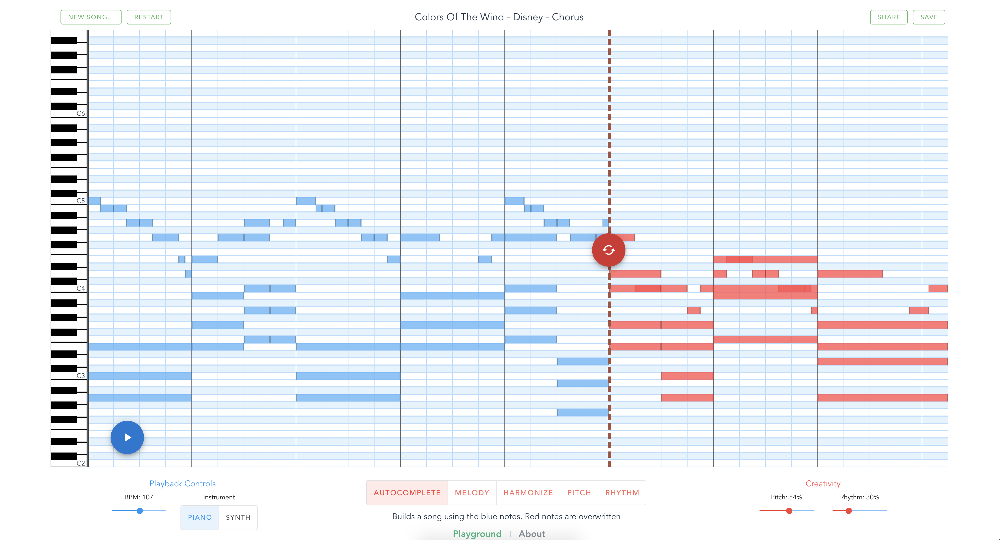

# MusicAutobot

Using Deep Learning to generate pop music! 

You can also experiment through the web app - [musicautobot.com](http://musicautobot.com)



## Overview

Recent advances in NLP have produced amazing [results](https://transformer.huggingface.co/) in generating text. 
[Transformer](http://jalammar.github.io/illustrated-transformer/) architecture is a big reason behind this.

This project aims to leverage these powerful language models and apply them to music. It's built on top of the fast.ai [library](https://github.com/fastai/fastai)

## Implementation

**MusicTransformer** - This basic model uses [Transformer-XL](https://github.com/kimiyoung/transformer-xl) to take a sequence of music notes and predict the next note.  

**MultitaskTransformer** - Built on top of MusicTransformer, this model is trained on multiple tasks.
 * Next Note Prediction (same as MusicTransformer)
 * [BERT](https://github.com/google-research/bert) Token Masking
 * Sequence To Sequence Translation - Using chords to predict melody and vice versa.

Training on multiple tasks means we can generate some really cool predictions (Check out this [Notebook](notebooks/multitask_transformer/Generate.ipynb)):
1. [Harmonization](http://musicautobot.com/#/predict/2b4f5e6613f366bad7b4f39c61be32b9) - generate accompanying chords
2. [Melody](http://musicautobot.com/#/predict/3087b73963aaa2bae62424808a251628) - new melody from existing chord progression
3. Remix [tune](http://musicautobot.com/#/predict/1bbfcb942133414a5664a35a7e7b5612) - new song in the rhythm of a reference song
4. Remix [beat](http://musicautobot.com/#/predict/71d7ff59f67fffa98614c841101e1b6b) - same tune, different rhythm


## How it works

Details are explained in this 4 part series:
* [Part I](https://towardsdatascience.com/creating-a-pop-music-generator-with-the-transformer-5867511b382a) - Creating a Pop Music Generator
* [Part II](https://towardsdatascience.com/practical-tips-for-training-a-music-model-755c62560ec2) - Implementation details
* [Part III](https://towardsdatascience.com/a-multitask-music-model-with-bert-transformer-xl-and-seq2seq-3d80bd2ea08e) - Multitask Transformer
* [Part IV](https://towardsdatascience.com/how-to-remix-the-chainsmokers-with-a-music-bot-6b920359248c) - Composing a song with Multitask


## Example Notebooks

1. Play with predictions on Google Colab
 * [MusicTransformer Generate](https://colab.research.google.com/github/bearpelican/musicautobot/blob/master/notebooks/music_transformer/Generate_colab.ipynb) - Loads a pretrained model and shows how to generate/predict new notes
 * [MultitaskTransformer Generate](https://colab.research.google.com/github/bearpelican/musicautobot/blob/master/notebooks/multitask_transformer/Generate_colab.ipynb) - Loads a pretrained model and shows how to harmonize, generate new melodies, and remix existing songs.

2. MusicTransformer
 * [Train](notebooks/music_transformer/Train.ipynb) - End to end example on how to create a dataset from midi files and train a model from scratch
 * [Generate](notebooks/music_tranformer/Generate.ipynb) - Loads a pretrained model and shows how to generate/predict new notes
 
3. MultitaskTransformer
 * [Train](notebooks/multitask_transformer/Train.ipynb) - End to end example on creating a seq2seq and masked dataset for multitask training.
 * [Generate](notebooks/multitask_tranformer/Generate.ipynb) - Loads a pretrained model and shows how to harmonize, generate new melodies, and remix existing songs.
 
4. Data Encoding
 * [Midi2Tensor](notebooks/data_encoding/Midi2Tensor.ipynb) - Shows how the libary internally encodes midi files to tensors for training.
 * [MusicItem](notebooks/data_encoding/MusicItem-Transforms.ipynb) - MusicItem is a wrapper that makes it easy to manipulate midi data. Convert midi to tensor, apply data transformations, even play music or display the notes within browser.

## Pretrained Models

Pretrained models are available as MusicTransformer and MultitaskTransformer (small and large).

Each model has an additional `keyC` version. `keyC` means that the model has been trained solely on music transposed to the key of C (all white keys). These models produce better results, but expects the input to all be in the key of C.

1. MusicTransformer (600 MB) - [AnyKey](https://ashaw-midi-web-server.s3-us-west-2.amazonaws.com/pretrained/MusicTransformer.pth) | [KeyC](https://ashaw-midi-web-server.s3-us-west-2.amazonaws.com/pretrained/MusicTransformerKeyC.pth)

2. MultitaskTransformer
 * Small (700 MB) - [AnyKey](https://ashaw-midi-web-server.s3-us-west-2.amazonaws.com/pretrained/MultitaskSmall.pth) | [KeyC](https://ashaw-midi-web-server.s3-us-west-2.amazonaws.com/pretrained/MultitaskSmallKeyC.pth)
 * Large (2.1 GB) - [AnyKey](https://ashaw-midi-web-server.s3-us-west-2.amazonaws.com/pretrained/MultitaskLarge.pth) | [KeyC](https://ashaw-midi-web-server.s3-us-west-2.amazonaws.com/pretrained/MultitaskLargeKeyC.pth)

For details on how to load these models, follow the [Generate](notebooks/music_tranformer/Generate.ipynb) and [Multitask Generate](notebooks/multitask_tranformer/Generate.ipynb) notebooks

## Source Code

* [musicautobot/](musicautobot)
 * [numpy_encode.py](musicautobot/numpy_encode.py) - submodule for encoding midi to tensor
 * [music_transformer.py](musicautobot/music_transformer) - Submodule structure similar to fastai's library.
   * Learner, Model, Transform - MusicItem, Dataloader
 * [multitask_transformer.py](musicautobot/multitask_transformer) - Submodule structure similar to fastai's library.
   * Learner, Model, Transform - MusicItem, Dataloader

## Scripts

CLI scripts for training models:  
**[run_multitask.py](scripts/run_multitask.py)** - multitask training
```
python run_multitask.py --epochs 14 --save multitask_model --batch_size=16 --bptt=512 --lamb --data_parallel --lr 1e-4
```
**[run_music_transformer.py](scripts/run_music_transformer.py)** - music model training
```
python run_music_transformer.py --epochs 14 --save music_model --batch_size=16 --bptt=512 --lr 1e-4
```
**[run_ddp.sh](scripts/run_ddp.sh)** - Helper method to train with mulitple GPUs (DistributedDataParallel). Only works with run_music_transformer.py  
```
SCRIPT=run_multitask.py bash run_ddp.sh --epochs 14 --save music_model --batch_size=16 --bptt=512 --lr 1e-4
```

**Commands must be run inside the `scripts/` folder**

## Installation

1. Install anaconda: https://www.anaconda.com/distribution/  


2. Run:  

```bash
git clone https://github.com/bearpelican/musicautobot.git

cd musicautobot

conda env update -f environment.yml

source activate musicautobot
```

3. Install Musescore - to view sheet music within a jupyter notebook  

    Ubuntu:  
    ```bash
    sudo apt-get install musescore
    ```
    
    MacOS - [download](https://musescore.org/en/download)

## Flask Server

Installation:  
```bash
cd serve

conda env update -f environment.yml
```

#### S3 Bucket
You need to setup an s3 bucket to save your predictions.
After you've created a bucket, update the config [api/api.cfg](api/api.cfg) with the new bucket name.

Development:
```bash
python run.py
```

Production:
```bash
gunicorn -b 127.0.0.1:5000 run_guni:app  --timeout 180 --workers 8
```

## Data

Unfortunately I cannot provide the dataset used for training the model.

Here's some suggestions:

* [Classical Archives](https://www.classicalarchives.com/) - incredible catalog of high quality classical midi
* [HookTheory](https://www.hooktheory.com/) - great data for sequence to sequence predictions. Need to manually copy files into hookpad 
* [Reddit](https://www.reddit.com/r/datasets/comments/3akhxy/the_largest_midi_collection_on_the_internet/) - 130k files
* [Lakh](https://colinraffel.com/projects/lmd/) - great research dataset


## Acknowledgements

This project is built on top of [fast.ai's](https://github.com/fastai/fastai) deep learning library and music21's incredible musicology [library](https://web.mit.edu/music21/).

Inspired by [bachbot](https://github.com/feynmanliang/bachbot) and [clara](http://christinemcleavey.com/clara-a-neural-net-music-generator/)

Special thanks to [SPC](https://southparkcommons.com) and [PalapaVC](https://www.palapavc.com/)
